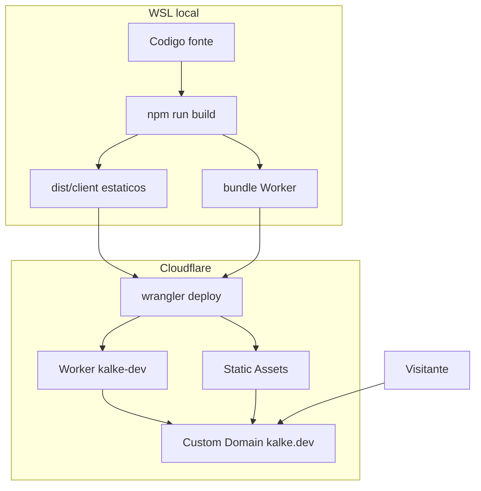

# kalke.dev — guia de infra (passo a passo)

Portfolio pessoal publicado em **[kalke.dev](https://kalke.dev)**.

Este README documenta **o que foi feito na infraestrutura** — do zero no WSL até o domínio customizado na Cloudflare. A implementação React em si fica de fora de propósito; o foco é o caminho até o site estar no ar.

---

## Visão geral (o que estamos hospedando)

```text
Seu PC (WSL)
  → npm run build   (gera HTML/CSS/JS estáticos + Worker)
  → wrangler deploy (sobe para a rede da Cloudflare)
  → kalke.dev       (Custom Domain aponta para o Worker)
```

| Peça | Papel |
|------|--------|
| **Vite** | Empacota o frontend (build local) |
| **Cloudflare Vite plugin** | Integra o build com o ecossistema Workers |
| **Worker** (`src/worker`) | Código serverless na edge (aqui só um healthcheck; o site em si é estático) |
| **Static Assets** | Os arquivos do React (`dist/client`) servidos pela Cloudflare |
| **Wrangler** | CLI oficial: login, build de deploy, upload, rotas/domínios |
| **Custom Domain** | `kalke.dev` / `www.kalke.dev` ligados ao Worker (DNS + TLS pela Cloudflare) |

Não usamos o produto legado “Pages” como caminho principal. O modelo atual da Cloudflare para esse tipo de app é **Workers + Assets** (mesmo dashboard: *Workers & Pages*).

---

## 0. Contexto inicial

Antes de começar:

1. Domínio **kalke.dev** já registrado / gerenciado na **Cloudflare** (nameservers na Cloudflare).
2. Ambiente de desenvolvimento: **WSL2 (Ubuntu)** no Windows.
3. Node do Windows existia no PATH, mas o binário Linux `node` **não** estava confiável no WSL — isso quebraria `npm`/`wrangler` de forma inconsistente.

Por isso o primeiro passo real foi instalar Node **dentro do Linux (WSL)**.

---

## 1. Instalar Node no WSL (via nvm)

### Por que nvm?

No WSL, misturar o Node do Windows (`/mnt/c/Program Files/nodejs/`) com ferramentas Linux costuma dar erro de path, permissões e `ENOENT`. A solução limpa é um Node nativo Linux.

### O que foi executado

```bash
# instalar o nvm
curl -o- https://raw.githubusercontent.com/nvm-sh/nvm/v0.40.3/install.sh | bash

# carregar o nvm na sessão atual
export NVM_DIR="$HOME/.nvm"
[ -s "$NVM_DIR/nvm.sh" ] && . "$NVM_DIR/nvm.sh"

# instalar e fixar Node 22 LTS
nvm install 22
nvm alias default 22

# validar (precisa apontar para ~/.nvm/...)
node -v    # ex: v22.23.2
npm -v
which node # /home/kalke/.nvm/versions/node/v22.23.2/bin/node
```

O instalador também adicionou o carregamento do nvm no `~/.zshrc`. Em terminais novos, o Node já deve aparecer; se não:

```bash
export NVM_DIR="$HOME/.nvm" && . "$NVM_DIR/nvm.sh"
```

---

## 2. Criar o projeto Cloudflare (scaffold)

Pasta do projeto:

```text
/home/kalke/personal_projects/kalke-dev
```

### Comando usado (template oficial React + Vite + Workers)

```bash
cd /home/kalke/personal_projects

npm create cloudflare@latest kalke-dev \
  -- --template=cloudflare/templates/vite-react-template \
  --lang=ts \
  --no-deploy \
  --no-git \
  --no-open
```

Isso clona o [vite-react-template](https://github.com/cloudflare/templates/tree/main/vite-react-template) e já roda `npm install`.

### O que esse template entrega (infra)

```text
kalke-dev/
├── wrangler.json          # nome do Worker, assets, rotas/domínios
├── vite.config.ts         # plugin @cloudflare/vite-plugin
├── src/
│   ├── react-app/         # frontend (fora do escopo deste README)
│   └── worker/index.ts    # entry do Worker (API / edge)
├── dist/                  # gerado no build (não versionar)
│   ├── client/            # estáticos do site
│   └── kalke_dev/         # bundle do Worker para upload
└── package.json           # scripts: dev, build, deploy
```

Pontos importantes:

- `wrangler.json` → `assets.directory` aponta para `./dist/client`
- `assets.not_found_handling: "single-page-application"` → rotas do React não dão 404 no refresh
- `main` → `./src/worker/index.ts` (Worker empacotado junto no deploy)

---

## 3. Configurar o Worker e o domínio (`wrangler.json`)

Arquivo relevante: [`wrangler.json`](wrangler.json)

Configuração efetiva usada no deploy:

```jsonc
{
  "name": "kalke-dev",
  "main": "./src/worker/index.ts",
  "compatibility_date": "2025-10-08",
  "compatibility_flags": ["nodejs_compat"],
  "observability": { "enabled": true },
  "upload_source_maps": true,
  "assets": {
    "directory": "./dist/client",
    "not_found_handling": "single-page-application"
  },
  "routes": [
    { "pattern": "kalke.dev", "custom_domain": true },
    { "pattern": "www.kalke.dev", "custom_domain": true }
  ]
}
```

### O que cada bloco significa

| Campo | Significado |
|-------|-------------|
| `name` | Nome do Worker na conta Cloudflare (`kalke-dev`) |
| `main` | Código do Worker que sobe junto com os assets |
| `assets.directory` | Pasta de estáticos após o `vite build` |
| `not_found_handling: single-page-application` | Fallback para `index.html` (SPA) |
| `routes` + `custom_domain: true` | Liga o hostname ao Worker; a Cloudflare cria DNS + certificado |

### Por que Custom Domain (e não só CNAME na mão)?

Com o domínio já na zona Cloudflare, `custom_domain: true` faz o Wrangler:

1. Associar `kalke.dev` / `www.kalke.dev` ao Worker
2. Criar/ajustar o registro DNS necessário
3. Emitir/renovar TLS automaticamente

Documentação: [Custom Domains](https://developers.cloudflare.com/workers/configuration/routing/custom-domains/).

> **Nota:** tentamos habilitar `workers_dev: true` para uma URL `*.workers.dev`, mas a conta ainda não tinha subdomain `workers.dev` registrado. O site ficou só nos custom domains — o que é o desejado para produção.

---

## 4. Git local

```bash
cd /home/kalke/personal_projects/kalke-dev
git init
git add -A
git commit -m "Initial personal portfolio for kalke.dev."
```

Não há remote obrigatório para o deploy funcionar: o fluxo atual é **deploy direto via Wrangler** (upload a partir da máquina). CI no GitHub (Workers Builds) pode ser um próximo passo, mas não foi necessário para o site entrar no ar.

---

## 5. Autenticar o Wrangler na Cloudflare

```bash
cd /home/kalke/personal_projects/kalke-dev
npx wrangler login
```

### O que acontece

1. O Wrangler sobe um servidor local temporário (callback em `http://localhost:8976/...`)
2. Abre (ou imprime) a URL OAuth da Cloudflare
3. Você autoriza a conta no browser
4. O token fica salvo em `~/.config/.wrangler/config/default.toml`

Validação:

```bash
npx wrangler whoami
```

Deve mostrar a conta associada (ex.: email + Account ID).

### Pegadinha no WSL

O redirect OAuth usa `localhost`. Se o browser abre no **Windows** e o callback não alcança o listener no **WSL**, o login pode dar timeout. Soluções comuns:

- Garantir *localhost forwarding* do WSL2 (versões recentes costumam ter)
- Rodar `wrangler login --browser false`, abrir a URL manualmente e completar rápido
- Alternativa profissional: criar um **API Token** no dashboard e exportar `CLOUDFLARE_API_TOKEN` (sem OAuth)

Neste projeto o login OAuth concluiu e o `whoami` passou a autenticar a conta correta.

---

## 6. Build e deploy

### Scripts (`package.json`)

| Script | Comando | Uso |
|--------|---------|-----|
| `dev` | `vite` | desenvolvimento local |
| `build` | `tsc -b && vite build` | gera `dist/client` + bundle do Worker |
| `deploy` | `wrangler deploy` | sobe para a Cloudflare |

### Fluxo de publicação

```bash
export NVM_DIR="$HOME/.nvm" && . "$NVM_DIR/nvm.sh"
cd /home/kalke/personal_projects/kalke-dev

npm run build
npm run deploy
# ou: npx wrangler deploy
```

### O que o deploy faz (por baixo)

1. Lê a config (no build com Vite plugin, o Wrangler pode usar uma config “redirecionada” em `dist/.../wrangler.json`)
2. Lista e faz upload dos arquivos em `dist/client` (HTML/CSS/JS/favicon)
3. Faz upload do Worker (`kalke-dev`)
4. Aplica triggers/rotas — incluindo Custom Domains

Saída típica de sucesso:

```text
Uploaded kalke-dev
Deployed kalke-dev triggers
  kalke.dev (custom domain)
  www.kalke.dev (custom domain)
Current Version ID: ...
```

A partir daí o site responde em:

- https://kalke.dev  
- https://www.kalke.dev  

### DNS

Após o Custom Domain, a Cloudflare passa a resolver o hostname com IPs da rede dela (registros **A** / **AAAA**). Propagação local às vezes demora alguns minutos (cache DNS do SO/browser).

---

## 7. Ciclo de atualização (depois do primeiro deploy)

Sempre que mudar conteúdo ou layout:

```bash
# 1) editar (ex.: src/react-app/content.ts)
# 2) testar local
npm run dev

# 3) publicar
npm run build
npm run deploy

# 4) (opcional) versionar
git add -A
git commit -m "Descreva o porquê da mudança."
```

Não precisa recriar o Worker nem reconfigurar o domínio a cada vez — o `deploy` atualiza a versão ativa.

---

## 8. Onde olhar no dashboard Cloudflare

1. [Workers & Pages](https://dash.cloudflare.com/) → worker **`kalke-dev`**
2. Aba **Domains** / **Settings → Domains & Routes** → `kalke.dev`, `www.kalke.dev`
3. Zona DNS de **kalke.dev** → registros criados/geridos para o Worker
4. **Deployments / Versions** → histórico de uploads (Version ID)

---

## 9. Mapa mental: local → edge



---

## 10. Troubleshooting rápido

| Sintoma | Causa provável | O que fazer |
|---------|----------------|-------------|
| `node: not found` no WSL | Node do Windows no PATH / nvm não carregado | `source ~/.nvm/nvm.sh` e conferir `which node` |
| `wrangler login` timeout | Callback `localhost` WSL ↔ Windows | Retry, `localhostForwarding`, ou API Token |
| Deploy ok, site “não abre” | Cache DNS / só IPv6 em rede sem IPv6 | Esperar, `1.1.1.1`, ou testar em outra rede/dispositivo |
| 404 em rota profunda do React | SPA fallback ausente | Manter `not_found_handling: "single-page-application"` |
| Erro com `workers_dev` | Subdomain `*.workers.dev` não registrado na conta | Registrar no onboarding Workers **ou** usar só Custom Domain (como fizemos) |

---

## 11. Próximos passos de infra (opcional)

- Registrar subdomain `workers.dev` no dashboard (URL de preview além do domínio)
- Conectar o repo no GitHub + **Workers Builds** (deploy automático no `git push`)
- Separar ambientes (`staging.kalke.dev` vs produção) com `env` no Wrangler
- Observabilidade: logs/metrics já com `observability.enabled` — aprofundar no dashboard

---

## Referências

- [Workers Static Assets](https://developers.cloudflare.com/workers/static-assets/)
- [Custom Domains](https://developers.cloudflare.com/workers/configuration/routing/custom-domains/)
- [Wrangler CLI](https://developers.cloudflare.com/workers/wrangler/)
- [Template vite-react](https://github.com/cloudflare/templates/tree/main/vite-react-template)
